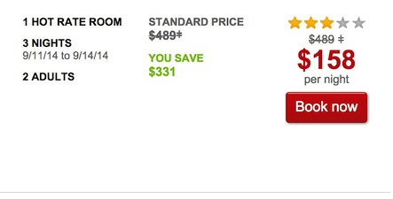

hotwire_scam
============

This is the place where I will tell you the story about how hotwire.com uses language, typography, and UX to scam their customers into unloading their lowest-quality inventory in the belief that they are getting an amazing deal on a higher-priced hotel. 

### The ol' Cloak and Double Dagger
Look at the image below, specifically at the two places where the $489 figure is crossed out. You might think this is saying "The price is usually $489 +" and the strikethrough indicates that this Hotel has a Hot Rate that is much lower than it usually is. We're familiar with this visual language. It indicates a sale. 

If you look at the right side, you can notice a small separation between the crossed-out number and the plus sign. This is how you are supposed to tell that neither symbol is a crossed out plus sign. They are both symbols meant to direct the eagle-eyed consumer to the footnote. The woman at the call center called it an asterisk (*), but it's a [double dagger](http://en.wikipedia.org/wiki/Dagger_(typography)) (‡). The double dagger is a symbol that is used to direct a reader to a footnote, but in this case you can't deny that it drastically reduces the chance that the visitor will notice and do so. 

