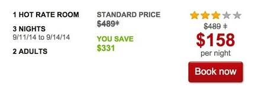
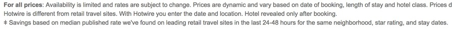

### True confessions: I was tricked by a Hotwire scam

This is the story about how [hotwire](http://www.glassdoor.com/Reviews/Hotwire-Reviews-E14912.htm?sort.sortType=OR&sort.ascending=true) scams their customers into unloading their lowest-quality inventory using slimy tricks of language, typography, and UX, that imply they are getting an amazing deal on a higher-priced hotel, when they are just getting a room that is near some higher-priced hotels. They did it to me and I want my money back. At the very least, I don't want any of my friends to fall for this scam themselves. 

If you are a lawyer and believe that hotwire.com is crossing legal lines as well as those of poor taste, please contact me. 

### The ol' Cloak and Double Dagger
Look at the image below, specifically at the two places where the $489 figure is crossed out. You might think this is saying "The price is usually $489+" ($489 or more!? this must be a pretty swanky mystery hotel), and the strikethrough indicates that this Hotel has a Hot Rate that is much lower than it usually is. We're familiar with this visual language. It indicates a sale. 

If you look at the right side, (under the stars) you can notice a small separation between the crossed-out number and the plus sign, but on the right under "standard price" the line is completely continuous through all of the symbols. The eagle-eyed consumer might have noticed the gap and gone to the foot of the page for a disclaimer. The woman at the call center called it an asterisk (*), but it's a [double dagger](http://en.wikipedia.org/wiki/Dagger_(typography)) (‡). The double dagger is a symbol that is used to direct a reader to a footnote, but in this case you can't deny that it drastically reduces the chance that the visitor will notice and do so. 

### The footnote

Ok, so if you do go down to the footnote, you get this: 

This says that the "Standard Price" isn't the price that one would normally pay for the room you're about to book blind. The standard price, listed right above the hotwire price, is a conveniently-placed factoid about the going rate for the median hotel room in that neighborhood. You're not getting a great deal at the Ritz, you're getting a couple bucks off a room, next door to the Ritz, at the Holiday Inn Express. The "discount" is that they've chosen a hotel for you that is **already cheaper** than the Ritz, because **it's a different hotel**. (In this framework, I guess the Ritz itself would be a Cold Rate Hotel! because its rates are higher than the median of the area).

If you were sneaky enough to find the footnote, thinking in the terms of a sale price / discounted price, it would be pretty confusing, regardless. I am pretty sure that I would have understood it if I had found the camouflaged double dagger and read the footnote. But hindsight is 20/20. In truth, the concept was explained to me by the customer service agent when I called to ask why they had implied that the Holiday Inn Express Brooklyn had a standard rate of $489. I, of course, could find no rooms there at that rate. She showed me the "asterisk" (double dagger) that explains the "discount" (difference in cost between a shitty hotel in a nice neighborhood and the nice hotels that are around it). 

### So what is a "Hot Rate Hotel"? 

Now I know that a "Hot Rate Hotel" is a hotel whose prices are drastically below other hotels in the same neighborhood at the same star rating. A.k.a., a Hot Rate Hotel is the shittiest hotel around. Because, I'm sure, no one wants to stay in a shitty hotel in a nice area, hotwire had to get creative and scam us into thinking we were getting a great rate at a fancy hotel. Instead, you're a chump with a regular rate at the Holiday Inn Express Brooklyn. 

Now you can think of all kinds of things in your life as smart discounts, instead of just crappier things. You got a great discount price on that take-out cheeseburger you're eating in front of the TV, when you compare it to the price other people are paying for steaks in your neighborhood. You bargain shopper!

I hope that unloading these "Hot Load Hotel" rooms is extremely high priority to hotwire, because I can't imagine anyone using their site again after suffering the insult of falling for this scam. 

### The last little thing... 

On the phone, the customer service agent also explained to me what a median is. She told me that a median is the middle number in a set that's been ranked in order. (Educational!) The median rate they claimed to have calculated for a three-star hotel in Brooklyn, based on "published" rates from "leading retail travel sites" in the 24-48 hours preceding 5:00pm Eastern time on 8/31/14, is thus $489. Looking at Kayak, I say, "Shenanigans." 

I'll be back with more on that later... 
